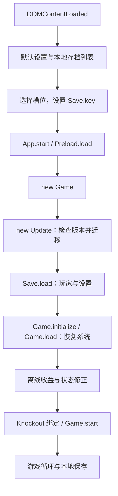
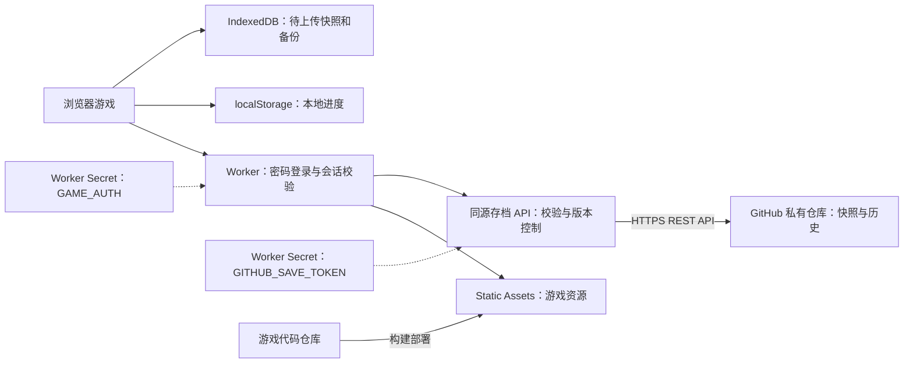
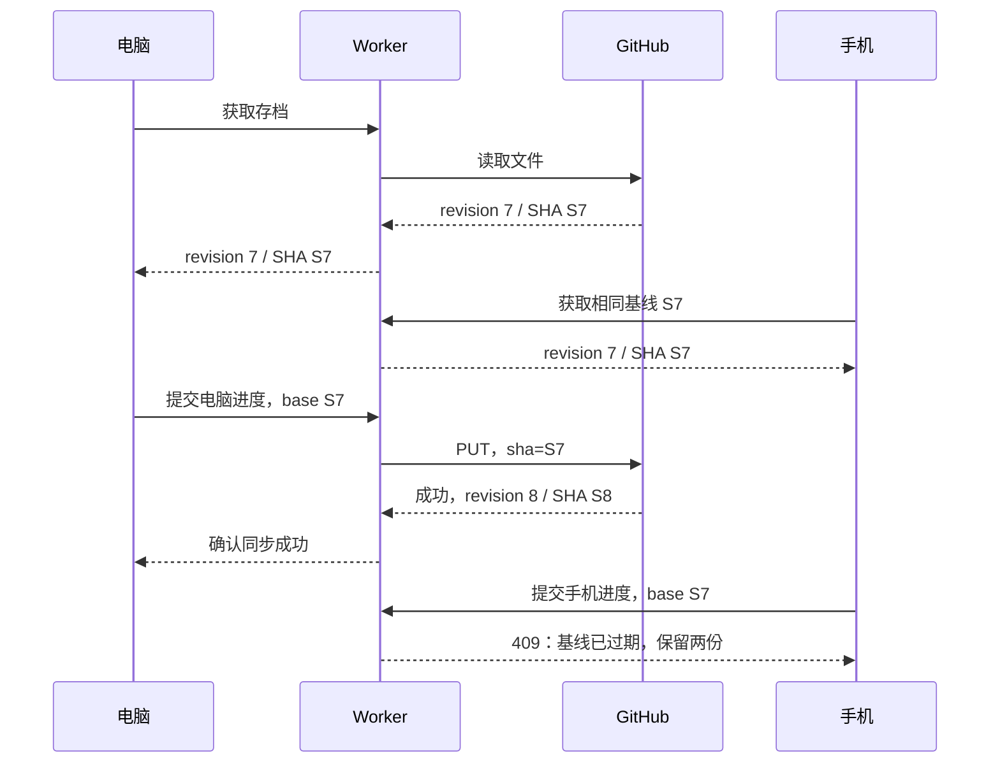
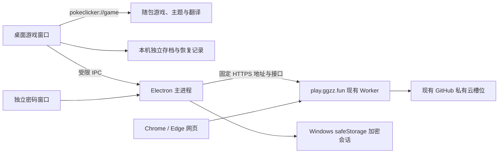

# PokéClicker 项目架构与 GitHub 私有仓库云存档设计

> 状态：云存档第一版已完成本地验收；2026-09-20 按用户要求将 Access 邮箱门禁替换为游戏专用密码。用户随后已将网站部署到 play.ggzz.fun，并设置两项 Secret；GitHub 连接故障的 Worker 运行时兼容修复已发布，真实同步验收进展见实现记录。
> 认证决策变更：原 Access + OTP 决策已被本文第 5 节替代，不再需要 Zero Trust 团队、邮箱、AUD 或付款方式配置。
> 实际交付与验证见 [实现记录](cloud-save-implementation.md)；部署和使用见 [新手操作手册](cloud-save-user-guide.md)。
> 下文原代码分析描述的是实施前基线，当前行为以实现记录为准。
> 代码基线：a3062f11fdcf4c22e6a9a7d4747e5bb6614f44ab；项目版本：0.10.26。
> 用户已明确选择：优先使用 GitHub 私有仓库保存存档，不要求个人电脑常开。
> 桌面版决策：随后选择开发本地运行、联网同步的 Windows 客户端；架构与边界见第 16 节。网页、桌面共享既有云槽位与后台，不改变存档归属。
> 后续玩法提案：地牢助手寻路和取消道具涨价、官方代码合并与存档兼容边界，见 [自用玩法优化设计](private-gameplay-design.md)。该提案尚未实现；本次不改云协议，采用网页和 EXE 同步升级。自动拦截旧客户端属于后续可选增强，当前线上没有该检查。

## 1. 结论与范围

方案可行。采用 **Cloudflare 静态托管 + 游戏专用密码登录 + Worker 存档 API + 独立 GitHub 私有存档仓库**。网页版在浏览器运行；新增 Windows 桌面版把同一份游戏资源随安装包放在本地，支持离线启动。两种客户端都保留本地存档，再将完整快照提交到同一 GitHub 云槽位。

这能做到不购买、不维护 VPS，不需要自己的电脑一直开机；存档实际驻留 GitHub。若要求数据放在自己的电脑或 NAS，则使用第 12 节的自托管方案。域名可继续留在原注册商，配置 Cloudflare DNS 和自定义域名即可，无须转入 Cloudflare 注册。

核心决策：

- 网页只访问同源 API。桌面版由受限主进程桥接固定后台 API。GitHub token 仅放 Worker Secret，不进入网页、桌面安装包、构建产物、浏览器存储或仓库。
- 本地约每 10 秒自动保存；云端自动同步默认关闭，用户开启后每 10 分钟尝试，提供“立即同步”“同步后切换设备”。
- 首版一个游戏专用密码、一个云槽位；保留原有本地多存档。云槽位采用稳定 UUID，与设备本地槽位映射。
- 云档选择与安装在 App.start() 前完成，运行中不热替换游戏对象。
- 写入携带上次同步的 GitHub 文件 blob SHA；不匹配时显式处理冲突，不自动合并游戏数值。
- 保留原版导入导出，以 Git 历史提供回退，同时定期下载独立备份。

适用：个人少量设备、分钟级同步、主要在一台设备游玩。该方案不提供多人在线、服务端挂机、反作弊或跨设备实时合并。关闭网页后，仍由现有客户端规则在下次启动时计算离线收益。

## 2. 现有项目架构

### 2.1 技术与模块

| 层次 | 代码入口 | 职责与设计含义 |
| --- | --- | --- |
| 页面与样式 | [src/index.html](../src/index.html)、src/components、src/styles | HTML 组件、Knockout 数据绑定、Bootstrap/jQuery、Less；同步界面沿用现有风格 |
| 旧全局脚本 | src/scripts、[tsconfig.json](../tsconfig.json) | App、Game、Player、Save、Update 等，输出 script.min.js |
| 模块化代码 | [src/modules/index.ts](../src/modules/index.ts)、[webpack.config.js](../webpack.config.js) | TypeScript 模块，经 Webpack 输出 modules.min.js |
| 新旧代码桥接 | [temporaryWindowInjection.ts](../src/modules/temporaryWindowInjection.ts)、[TemporaryScriptTypes.ts](../src/modules/TemporaryScriptTypes.ts) | 全局注入与旧脚本类型，新增同步模块要接入此边界 |
| 游戏状态聚合 | [Game.ts](../src/scripts/Game.ts#L17) | 队伍、钱包、孵化、农场、任务、统计、挑战等系统 |
| 内容与配置 | src/modules/pokemons、routes、requirements、src/scripts/towns、src/assets | 宝可梦、路线、解锁条件、城镇与图片，主要随客户端发布 |
| 构建和检查 | [package.json](../package.json)、[gulpfile.babel.js](../gulpfile.babel.js)、[CI](../.github/workflows/build.yml) | Gulp、Webpack、Vitest、ESLint、Stylelint |

项目是以客户端状态为中心的浏览器单机游戏，目前处于旧全局脚本向模块化代码迁移的结构。增加云存档无需重写玩法，也无需迁移到 React 或更换构建工具。

持久化模块通过 saveKey、toJSON()、fromJSON() 定义序列化能力，参见 [Saveable](../src/modules/DataStore/common/Saveable.ts) 和 [Feature](../src/modules/DataStore/common/Feature.ts)。Save.getSaveObject() 收集 App.game 的可存档模块，并额外保存成就；Game.load() 按 saveKey 分发恢复。云同步应复用这个聚合边界。

例如，[Battle](../src/modules/battles/Battle.ts#L33) 推进攻击，击败敌人后更新统计、孵化与捕捉；[Wallet](../src/modules/wallet/Wallet.ts#L69) 修改 observable 和累计统计。一次进度涉及多个系统，所以同步单位应是完整快照，不应各模块分别上传后任意拼接。

### 2.2 启动与游戏循环



证据：[入口](../src/scripts/index.ts#L10)、[App.start](../src/scripts/App.ts#L12)、[Game 构造与加载](../src/scripts/Game.ts#L50)。训练家卡片、右键菜单、新建按钮均能启动游戏，参见 [Profile](../src/modules/profile/Profile.ts#L100)、[SaveSelector](../src/modules/SaveSelector.ts#L29)、[选择界面](../src/components/saveSelector.html#L24)。实施时应统一启动协调，不能只拦一个按钮。

Game.start() 使用 requestAnimationFrame，并尝试创建浏览器 Web Worker 处理后台 tick。这个 Web Worker 是浏览器线程，与 Cloudflare Worker 不同。TICK_TIME 为 100 ms，SAVE_TICK 为 10 秒，参见 [GameConstants](../src/modules/GameConstants.ts#L12)。后台节流、设备休眠等会影响实际间隔，10 秒不是持久化时限保证。

### 2.3 存档格式与边界

[Save.store()](../src/scripts/Save.ts#L10) 连续写入三个 localStorage 键：

| 键 | 内容 | 云同步要求 |
| --- | --- | --- |
| player + Save.key | 地图位置、背包、效果、trainerId、_lastSeen 等 | 复用 Player.toJSON() 的字段筛选 |
| save + Save.key | 系统状态、统计、成就、profile、update.version 等 | 完整保留字段，避免旧同步器丢弃新增系统 |
| settings + Save.key | 本槽位设置 | 首版整份同步；同步设备配置另存 |

现有导出容器为 { player, save, settings }，.txt 文件使用 [SaveSelector.btoa()/atob()](../src/modules/SaveSelector.ts#L127) 处理 Unicode 和 Base64。Base64 不是加密。云仓库存 UTF-8 JSON，下载为原版导入文件时再复用原有编码。

关键约束：

- [SaveSelector](../src/modules/SaveSelector.ts#L12) 的界面上限是 9 个本地档，通过所有 save 前缀键发现存档。元数据不能取名 saveCloud、saveBackup，使用 pcCloud: 前缀或独立 IndexedDB。
- Save.key 是本地后缀，旧档可为空字符串，新建通常为六位随机串。[trainerId](../src/scripts/Player.ts#L87) 也是六位标识，两者都不是全局唯一云 ID。
- 三次 localStorage.setItem 不是跨键事务。云快照只能在三段全部保存成功后产生；容量不足或中途异常必须阻止同步，不能将混合状态上传。
- [Save.loadFromFile()](../src/scripts/Save.ts#L200) 用 FileReader 加固定一秒定时器读取后覆盖本地并刷新。新增同步应抽出可等待、可校验的解析和安装方法，不照搬定时器。
- [Game.load()](../src/scripts/Game.ts#L97) 捕获单模块恢复异常后继续。恢复流程必须记录这些异常，不能只因出现游戏界面就判定恢复成功并覆盖云档。
- [Game.save()](../src/scripts/Game.ts#L571) 尊重 disableAutoSave。自动云同步也应尊重它；手动“立即同步”明确表示先保存当前进度再上传。
- [Save Data 窗口](../src/components/saveModal.html#L21) 已说明 Discord 绑定不是云存档。

### 2.4 迁移、离线收益和域名切换

[Update.check()](../src/scripts/Update.ts#L3104) 拒绝比客户端更新的存档，按版本迁移并写回三段本地数据。应先安装云档，再进入该链路；服务端不执行游戏迁移。

[computeOfflineEarnings()](../src/scripts/Game.ts#L176) 根据 player._lastSeen 结算，其中该方法的离线结算时间最多取 24 小时，不代表所有玩法完整模拟 24 小时。[gameTick](../src/scripts/Game.ts#L525) 更新 _lastSeen 后保存。云端时间不得覆盖 _lastSeen；恢复只启动一次，不重复调用 initialize()。

更换域名后，原站 localStorage 不会自动迁移。首次在原站导出 .txt，在新域名导入再上传。不同 origin 的隔离参见 [MDN localStorage](https://developer.mozilla.org/en-US/docs/Web/API/Window/localStorage)。

## 3. 原方案评审

| 设想 | 判断 | 落地要求 |
| --- | --- | --- |
| 域名使用 Cloudflare | 可行 | 配置 DNS、HTTPS、自定义域名 |
| Cloudflare 部署游戏 | 可行 | 上传构建产物，并增加存档 Worker |
| 从 GitHub 读取存档 | 可行但不完整 | 还需保存、恢复、错误状态和冲突处理 |
| 仓库级 SSH 或 token | 可以限制特定仓库 | 首选 fine-grained PAT + Contents 读写，使用 HTTPS REST API |
| 网页里配置 token | 不采用 | 放 Worker Secret；登录保护无法隐藏已下发的前端 token |
| 不需要服务器 | 可以免维护服务器 | 仍有 Cloudflare 托管后端函数负责鉴权和持久化 |
| 邮箱验证可有可无 | 可以换认证方式，不能取消鉴权 | 使用游戏专用密码保护全站和存档 API，避免 Zero Trust 开通要求 |
| 存到自己的机器 | 与 GitHub 目标不同 | 账号由自己控制，存储介质由 GitHub 托管 |

[Deploy key](https://docs.github.com/en/authentication/connecting-to-github-with-ssh/managing-deploy-keys) 确实可绑定一个仓库并允许写入，但面向 Git/SSH 操作。这里只更新文件，HTTPS API 更直接，无需在 Worker 中维护 Git 工作目录或实现 SSH 推送。

个人首版使用 [fine-grained PAT](https://docs.github.com/en/authentication/keeping-your-account-and-data-secure/managing-your-personal-access-tokens)：只选存档仓库，授予 Contents: Read and write，设置有效期并轮换。PAT 不是文件路径级授权，Worker 还要约束路径。若以后面向多个用户，考虑 GitHub App。

## 4. 主方案架构



Cloudflare 支持将静态资源和 API 放在同一 Worker 部署单元，参见 [Static Assets](https://developers.cloudflare.com/workers/static-assets/)。已有 Pages 时也可选择 Pages + Functions；从零部署建议 Workers Static Assets，固定同源 API，减少跨域配置。

分成两个仓库：

- 游戏代码仓库：本项目 fork，负责构建和部署。
- 私有存档仓库：例如 pokeclicker-saves，初始化 README 和固定分支，只存数据，不触发游戏构建。

仓库布局：

```text
README.md
saves/
  <cloudSlotId>.json
```

每槽位一个当前 JSON，Git 提交提供历史。首版不维护可变 manifest，避免一次同步需要跨文件事务。云槽位 ID 放部署配置；以后多槽位可由目录列表发现，另加服务端数量校验。

## 5. 身份与凭据

### 5.1 配置

| 类型 | 字段 | 要求 |
| --- | --- | --- |
| Secret | GITHUB_SAVE_TOKEN | 仅 Worker 读取 |
| 运行配置 | GITHUB_OWNER、GITHUB_SAVE_REPO、GITHUB_SAVE_BRANCH | 固定目标，不接受请求任意指定 |
| 运行配置 | CLOUD_SLOT_ID | 固定单槽位 UUID |
| Secret | GAME_AUTH | 随机密码验证信息及独立会话签名密钥，仅 Worker 读取，由 cloud:password 生成 |
| 绑定 | 登录限流器 | 向导生成 Workers 原生 Rate Limit 绑定，不让用户手填 |
| 运行配置 | ALLOWED_ORIGIN、MAX_SAVE_BYTES | 同源约束与大小上限 |

[Worker Secrets](https://developers.cloudflare.com/workers/configuration/secrets/) 提供运行时密钥绑定。构建环境变量一旦经 Gulp replace 或 Webpack 注入客户端就不再保密。部署系统读取代码仓库的授权，与运行时读写存档仓库的 PAT 是两套权限。

### 5.2 访问控制

用户希望避免 Zero Trust 开通时的付款方式步骤，因此原“Access 邮箱验证码 + 精确邮箱 Allow”决策在 2026-09-20 被替代。当前采用单人游戏专用密码；不提供公共注册、多账户或邮箱重置功能。

- 配置工具生成 32 字符随机游戏密码；Cloudflare Secret 保存密码验证信息和独立 sessionKey，不保存可直接展示给前端的明文。密码仅在用户本机真实交互终端成功配置后显示；不经过聊天、源码或构建注入。
- /login 提供登录表单，POST /auth/login 校验密码并签发会话。Cookie 使用 HttpOnly、Secure、SameSite=Strict、Path=/；固定 7 天有效，不自动续期。服务端校验签名和到期时间。成功后先显示确认页，由用户点击进入游戏；重新登录时直接回原游戏页，避免第二个标签页意外启动。
- POST /auth/logout 清除当前浏览器 Cookie；不是全局会话撤销。重新运行 cloud:password 同时轮换密码与 sessionKey，撤销所有旧设备会话；不改变 GitHub 凭据和云槽位。
- Worker 使用 run_worker_first: true；页面、脚本、图片等资产先通过认证，再委托 ASSETS.fetch。未登录页面请求进入登录页，存档 API 返回 JSON 401，不能通过直接请求资产绕过门禁。GAME_AUTH 缺失或格式无效时关闭访问并返回配置错误，不公开放行。
- 登录使用 Workers 原生限流：同一 IP 每 60 秒最多 5 次，全站在同一 Cloudflare 位置每 60 秒最多 20 次。此限流不是跨全球的强一致计数，不能表述为全球攻击者只能尝试 20 次。高熵随机密码不依赖限流器来弥补弱口令。
- 既有 Access 应用如果仍保护游戏域名，会先触发旧邮箱门禁。迁移时只解除 play.ggzz.fun 的旧保护，不删除其他站点的应用或整个 Zero Trust 配置。

实施要求：

- 关闭 workers.dev 与预览入口，生产显式配置 workers_dev: false、preview_urls: false，参见 [workers.dev](https://developers.cloudflare.com/workers/configuration/routing/workers-dev/) 和 [Preview URLs](https://developers.cloudflare.com/workers/versions-and-deployments/preview-urls/)。
- 写操作校验预期方法与合法 Origin；存档只接受 JSON；登录和退出按各自允许的内容类型处理，不允许跨站表单伪造，不配置通配跨域。CORS 不能代替身份认证。
- 登录页、认证接口和存档 API 不得公共缓存；存档 API 返回 Cache-Control: private, no-store。CDN 缓存规则不能绕过 /api/*、/auth/*、/login 的 Worker 校验。存档不放静态构建产物，不通过公开 raw URL 提供。
- 日志只记录请求 ID、大小、耗时和错误类别，不记录 token、游戏密码、会话 Cookie 或存档正文。
- 用户登录失效与 GitHub PAT 失效分开呈现，后者属于服务配置故障。会话失效不清空本地存档或持久队列；当前游戏可保留本地进度，云面板提示在新标签页登录，再回原页检查连接与同步，不强制刷新正在游玩的页面。

## 6. 存档协议和 GitHub 适配

### 6.1 云端格式

以下类型是拟议协议，不是已实现代码：

```typescript
interface CloudSaveEnvelope {
    schemaVersion: 1;
    slotId: string;               // UUID
    revision: number;             // 首次为 1，Worker 根据原版本递增
    snapshotId: string;           // 本次上传 UUID，重试不变
    parentSnapshotId: string | null;
    serverSavedAt: string;        // Worker UTC 时间，仅供展示
    clientSavedAt: string;        // 不作为覆盖依据
    deviceId: string;             // 随机标识，不是凭据
    gameVersion: string;          // 与 payload.save.update.version 一致
    clientBuild: string;          // 区分同上游版本的不同 fork 构建
    payloadHash: string;          // 规范化 payload 的 SHA-256
    payload: {
        player: Record<string, unknown>;
        save: Record<string, unknown>;
        settings: Record<string, unknown>;
    };
}
```

浏览器与 Worker 使用相同规范化规则：对象键递归排序、数组顺序保留，UTF-8 编码后计算 SHA-256。哈希用于检测损坏和重复请求，不用于反作弊。payloadHash、GitHub 文件 blob SHA、Git commit SHA 是不同用途，不能混用。

需实测新档、中期档、长期档大小。应用层完整云 JSON 上限可暂设 5 MiB，包含解码后的大小限制；这只是待实测调整的保护值，不是当前用户存档大小结论。同步也受 localStorage 空间和 Worker CPU 限制，应测手机上的解析耗时。

### 6.2 API 合同

| 接口 | 用途 | 约束 |
| --- | --- | --- |
| GET /login | 游戏专用密码页或已登录退出入口 | 不泄露密码，禁止公共缓存 |
| POST /auth/login | 校验密码并签发会话 | 同源、请求体限制、登录限流 |
| POST /auth/logout | 当前浏览器退出 | 同源、清除 Cookie，不删除存档 |
| GET /api/cloud-save/status | 身份、配置与状态 | 不暴露 Secret，不随每次本地保存轮询 |
| GET /api/cloud-save/slots | 槽位列表 | 首版一个预配置槽位 |
| GET /api/cloud-save/slots/:id | 下载云档 | 返回 envelope、blobSha |
| PUT /api/cloud-save/slots/:id | 创建或更新 | 接收 baseBlobSha、baseRevision、snapshotId、deviceId、clientSavedAt、clientBuild、payload |

首次创建：baseBlobSha 为 null、baseRevision 为 0。更新必须携带上次确认的两项版本。成功返回新 blobSha、revision、snapshotId、payloadHash、serverSavedAt、commitSha。以 blobSha 字段作为并发凭证，不误用 GitHub HTTP 缓存 ETag。

错误：401/403 为用户认证或授权问题；409 为版本冲突；413 为过大；422 为结构或版本不支持；429 为限流；502/503 为上游或配置故障。当前 Worker 对未登录存档 API 返回 JSON 401；客户端仍防御性识别 HTML/重定向，保留待同步数据并提示从新标签页重新登录。

首版不提供远程删除。“删除本地存档”只删本机并解除同步映射，重新启用时显式恢复云档。未来云删除应有版本化 tombstone，防止离线设备复活已删存档。

### 6.3 GitHub 调用与版本约束

通过 GET /repos/{owner}/{repo}/contents/saves/{id}.json?ref={branch} 读取，PUT 同一路径写入 UTF-8 JSON 的 Base64，更新带原文件 sha、固定 branch。参数和权限见 [Contents API](https://docs.github.com/en/rest/repos/contents)。

分支使用配置中的原始名称，允许 lgz/save1 这类带斜杠名称；GET 的 ref 查询参数及分支查询路径分别使用 encodeURIComponent 编码，PUT 的 JSON branch 保留原字符串。用户无需为部署改成 main，也不应预先手工 URL 编码。

GitHub 适配器必须在真实 Workers 运行时验证：原生 fetch 不能以 GithubStore 对象作为 this 调用，默认请求应通过包装函数调用全局 fetch；仅在 Node 中注入假请求函数不足以发现这种兼容问题。重定向采用运行时支持的 manual，并明确拒绝 3xx；禁止自动 follow，避免将 Authorization 转发到重定向目标。仓库转移或改名造成重定向时，应更新固定仓库配置后重试，不追踪 Location。

该读取接口在文件超过 1 MB 后不能继续假定 content 含完整 Base64。先取得元信息与 blob SHA，必要时按同一个不可变 SHA 调用 [Git Blobs API](https://docs.github.com/en/rest/git/blobs) 获取 raw 正文；不要从可变分支分别读取 SHA 与正文，不持久缓存有时效的 download_url。

只有确认仓库、分支可访问后，才将路径缺失视为空槽位。私有仓库权限丢失也可能返回 404，应报告配置问题，不能直接创建新档。

客户端基于哪个 SHA 游戏，就用哪个 SHA 提交。Worker 可以读最新元信息校验，不能自动用最新 SHA 替换旧 SHA 再覆盖。GitHub 条件写入才是跨设备的防覆盖边界；Worker 内存锁不能覆盖多个实例。

## 7. 同步状态、冲突与恢复

### 7.1 本地元数据

在独立 IndexedDB 中保存 localKey 到 cloudSlotId 的映射、lastSyncedBlobSha、lastSyncedRevision、lastSyncedPayloadHash、当前待上传快照、正在上传的不可变请求、恢复预备副本和冲突副本。deviceId 与自动同步开关是设备配置，不进入游戏 payload。

首次关联存档需要用户明确选择“本地上传”或“云端恢复”，不能凭 trainerId、训练家名字或较新的时间戳自动认定为同一档。settings 首版随档同步，因此手机和电脑会共享布局等偏好；按设备拆分设置属于后续优化。

### 7.2 启动决策

启动前先读取本地同步基线，拉取云档，再决定使用哪份。dirty 表示本地完整 payload 的哈希不同于最后一次确认的同步哈希，不仅是一个内存布尔值。

| 本地情况 | 云端情况 | 行为 |
| --- | --- | --- |
| 没有本地档 | 云档存在 | 校验、备份目标槽位、安装云档，再启动 |
| 有本地档且未关联 | 云端为空 | 用户确认关联后首次上传 |
| 有本地档且未关联 | 云档存在 | 展示两份摘要，显式选择，不自动覆盖 |
| 已关联且不 dirty | 云 SHA 等于基线 | 使用本地档 |
| 已关联且不 dirty | 云 SHA 已变 | 启动前备份本地、恢复云档 |
| 已关联且 dirty | 云 SHA 等于基线 | 保留本地进度，按原基线上传 |
| 已关联且 dirty | 云 SHA 已变 | 进入冲突状态，保留两份 |
| 有本地档 | 网络、鉴权或 GitHub 故障 | 可选择继续本地，保留旧基线，标明未同步 |
| 无本地档 | 无法确认云端状态 | 保持选择界面并提供重试；不自动创建可回写的新档 |

不存在、超时、401、403、仓库错误不能统一处理为“云端没存档”。首次查询可以设置数秒超时，让已有本地档继续玩；超时绝不等于获得覆盖许可。

### 7.3 正常保存

1. 复用原序列化，一次性得到完整三段 JSON，在本地全部写成功后通知同步层；序列化或存储失败则报告并禁止上传该次快照。
2. 同步层持久化最新候选快照。未上传的旧候选可合并为最新一份，不按每个 tick 积压队列。
3. 每 10 分钟或手动触发，将候选冻结为带 snapshotId 的不可变请求，持久化后发给 Worker。同一槽位只允许一个请求在途。
4. Worker 校验身份、路径、体积、JSON 基本结构、游戏版本字段和基线；根据已确认的父版本构造 envelope，使用原 baseBlobSha 调用 GitHub 更新。
5. 成功后在本地事务中记录回执和新基线。若上传期间游戏又产生进度，仍保留新的 dirty 快照；不能因旧请求成功就把全部 dirty 清空。
6. 网络失败保留快照，退避重试；重新启动时从持久化队列恢复，不能只靠内存计时器。

自动同步间隔从上次尝试/成功状态明确调度，不因页面频繁隐藏或恢复无限触发。提供最后本地保存时间、最后云保存时间、“等待同步”“同步中”“登录失效”“冲突”等状态。

不依赖关闭页面才保存云档。[beforeunload 在手机上可能不触发](https://developer.mozilla.org/en-US/docs/Web/API/Window/beforeunload_event)，大存档的网络上传也不保证在页面退出前完成。visibilitychange/pagehide 仅作尽力触发；真正切换设备应点击“同步后切换设备”并看到成功回执。

### 7.4 冲突处理



冲突界面显示设备、服务端时间、版本、游戏时长等摘要，提供：

- 使用云端：先保存本地冲突副本，再在下次启动阶段安装云档。
- 使用本地覆盖：先保存两份副本，用户明确选择后，针对刚看过的远端 SHA 发起新提交；期间远端再次变化仍返回冲突。
- 两份均导出后暂不同步：可以继续本地游玩，但显著显示与云端分叉。

不按“金币更高”“游戏时长更长”“时间戳更新”自动选胜者，也不按字段取最大值。金币可能已消费、背包可能已兑换、挑战可能重置；字段合并会制造原本不存在的游戏状态。

CAS 能防止静默覆盖，不能禁止两个设备同时游玩；它不等于跨设备独占锁。首版不增加实时租约或 Durable Object。将来确有跨设备独占需求，再单独设计带过期和 fencing token 的租约，不能仅加一个布尔“正在游玩”。

### 7.5 响应丢失、并发与限流

- 上传超时后，不立刻换 snapshotId。重读云端，若 snapshotId 和服务端计算的 payloadHash 与本次请求相同，按已成功处理，不再制造重复提交。
- 若最新云档已变成别的快照，保守进入冲突/结果待确认；不能用新 SHA 盲目重试。首版不承诺任意历史跨度的严格 exactly-once。
- 创建文件有并发竞争时，重新读取并区分相同请求和真正冲突；不能把所有 GitHub 422 都解释为同一种冲突。
- GitHub 仓库级并发更新不同文件也可能发生分支竞争。客户端提交串行；后续多槽位最多有限重试，且必须先确认目标文件仍是原基线。不要把 Worker 全局变量当分布式锁。
- 429 或带限流信号的 403，遵守 Retry-After / 速率重置时间并指数退避；普通权限错误直接提示处理，不高频重试。原则参见 [GitHub REST 最佳实践](https://docs.github.com/en/rest/using-the-rest-api/best-practices-for-using-the-rest-api)。

### 7.6 同一浏览器多标签

同一个 origin 的多标签会共用 localStorage。在本地数据已互相覆盖后，云端 CAS 无法补救。使用 [Web Locks API](https://developer.mozilla.org/en-US/docs/Web/API/Web_Locks_API) 在启动前获取本地槽位独占锁，整个可写游戏会话持有；另一个标签只显示“此存档已在其他标签打开”，不启动游戏循环或导入覆盖。

锁也覆盖导入、删除、恢复入口。BroadcastChannel 可用于通知，但不代替锁。浏览器不支持 Web Locks 时，首版禁用云模式自动同步并说明限制，保留原本地模式和导出；不声称 localStorage 的先读后写能够提供互斥。跨设备仍由 GitHub CAS 保护。

### 7.7 安装与恢复的完整性

云端恢复要复用游戏加载流程，但先做好事务式准备：

1. 校验 JSON 顶层、三段数据、schemaVersion、gameVersion 和 payloadHash。旧版导入文件缺 settings 时，可以按现有兼容语义使用默认值。
2. 将目标槽位原始三段数据与待安装快照写入 IndexedDB 恢复日志；备份写入失败则中止替换。
3. 在 App.start() 前、持有槽位锁时写三段 localStorage；完成后标记日志状态，再执行现有迁移与加载。
4. 若中断或部分写入，下次启动先处理日志，完成或回滚，不能加载混合存档。Game.load/Update 报错时停止自动上传并保留原始云档。
5. 成功加载并完成首次有效本地保存后，才允许把迁移后的状态上传。旧客户端遇到新档直接拒绝，不降级覆盖。

运行中点击恢复时，先把云快照暂存在 IndexedDB，再刷新页面，由下一次启动安装；不要在旧游戏循环仍运行时直接覆写本地三段。现有 [Game.stop()](../src/scripts/Game.ts#L399) 只取消动画帧并清空卸载保存，没有终止后台 Web Worker，不能把单独调用 stop() 当成充分暂停。

历史恢复是“读取旧提交中的快照，作为当前基线上的新提交上传”，保持新的 snapshotId 和递增 revision。不能 reset/force-push 存档仓库，也不能复用旧 envelope 导致历史身份混乱。首版可通过 GitHub 历史下载并转换为原版 .txt，UI 历史浏览留待后续。

## 8. 建议的代码改动边界

下面是后续实施清单，本次没有改动这些源文件。

| 位置 | 建议变更 |
| --- | --- |
| [Save.ts](../src/scripts/Save.ts) | 抽出完整快照的导出、校验、安装方法；本地写成功后发通知；保留本地保存的同步性质 |
| [App.ts](../src/scripts/App.ts) | 统一启动协调，云档决策先于 new Game；防重复启动；加载失败通知同步层 |
| [scripts/index.ts](../src/scripts/index.ts) | 启动前恢复日志与云槽位发现，避免新设备看不到云档 |
| [SaveSelector.ts](../src/modules/SaveSelector.ts)、[Profile.ts](../src/modules/profile/Profile.ts)、[saveSelector.html](../src/components/saveSelector.html) | 所有选择/新建/导入入口通过统一协调；显示云关联；保持九槽位规则 |
| [Game.ts](../src/scripts/Game.ts) | 必要时暴露加载结果和真正暂停边界；不在 gameTick 中等待网络 |
| [saveModal.html](../src/components/saveModal.html) | 状态、立即同步、恢复、冲突入口；保留原版下载 |
| 拟新增 src/modules/cloudSave/ | 协议、快照校验、API client、同步状态机、持久化队列、恢复日志、浏览器锁 |
| [temporaryWindowInjection.ts](../src/modules/temporaryWindowInjection.ts)、[TemporaryScriptTypes.ts](../src/modules/TemporaryScriptTypes.ts) | 桥接旧脚本、更新实际类型；不手改构建生成的 src/declarations |
| 拟新增 cloud-save-worker/ | 独立 Worker 包、GitHub 适配、鉴权、运行配置与独立锁文件 |
| [tsconfig.json](../tsconfig.json) | 排除 cloud-save-worker；根配置当前默认扫描范围较大，不能让 Worker 被编译进旧浏览器脚本 |
| 部署配置与 CI | 构建产物检查、Secret 绑定、测试与预览环境隔离 |

不要全面替换 localStorage 为远程异步存储：Update、选择器、设置、导入导出均直接依赖它。保留本地运行方式，在边界加异步同步，是改动较小且便于跟进上游的做法。

自动云同步只上传成功的本地快照，不在游戏 tick 内进行 fetch、Base64 网络封装或等待鉴权。现有序列化也避免重复执行：优先复用刚刚保存的三段字符串，异步计算哈希与上传。

## 9. 构建、部署与首次迁移

### 9.1 现有构建事实

[package.json](../package.json) 声明 Node ^24.0.0。npm run clean 执行 npm ci 和翻译子模块初始化；npm run website 会更新翻译子模块、跑测试并生成生产站点。Gulp 先生成 build/，再复制至 docs/，见 [构建任务](../gulpfile.babel.js#L294)。

**docs/ 是会被清空的发布目录，并在 .gitignore 中忽略，所以设计文档放 design/。** Cloudflare 发布目录应选择构建后的 docs/，不选仓库根目录或 src/。

生产建议锁定当前 Git 子模块提交，不每次追随翻译仓库最新分支。可增加独立发布脚本，等价执行：

```bash
npm ci
git submodule update --init --recursive
npm test
npx cross-env NODE_ENV=production gulp website
```

这是初次评审时拟议的部署流程，当时未执行；后续已实现 cloud:build 与 cloud:deploy，用户也已完成发布，实际记录见实现文档。现有 npm run website 会调用 tl:update，不能在宣称可复现时忽略该行为。Worker 有自己的依赖安装、测试和 Wrangler 部署步骤，不复用浏览器 bundle。

当前源码资产目录实测 8,456 个文件、77,083,690 字节，最大单文件 576,593 字节；该统计不含翻译子模块和完整构建产物。Cloudflare Workers 免费静态资源文件数上限当前为 20,000，付费为 100,000，见 [Workers Limits](https://developers.cloudflare.com/workers/platform/limits/)。据源码规模推测适合静态托管，但上线前仍要统计 docs/ 实际文件数和最大单文件大小。

### 9.2 部署顺序

1. 创建并初始化专用私有存档仓库，指定固定分支；确认该分支规则允许该凭据通过 API 更新文件。
2. 填写域名、owner/repo/branch 等公开配置，保留固定 CLOUD_SLOT_ID；不再配置邮箱、Access team 或 audience。
3. 实现并测试 Worker API。固定 owner/repo/branch/slot，明确 GitHub API 版本与 User-Agent，禁止客户端任意传仓库路径。
4. 构建游戏，部署静态资产与 Worker；全站请求先进入 Worker。绑定自定义域名，关闭默认域名与预览入口。未设置 GAME_AUTH 时全站保持配置错误状态。
5. 运行 cloud:password 设置随机游戏密码及会话密钥；再创建仅该仓库可用的 fine-grained PAT，通过 cloud:secret 设置 GITHUB_SAVE_TOKEN，并记录 token 到期日。
6. 测试环境使用独立存档仓库、不同游戏密码和会话密钥，不能拿真实长期档做覆盖测试。已有游戏 Access 应用时仅解除对应域名的旧保护。
7. 从原站导出一份 .txt 并额外保留副本；新域名导入，明确绑定目标云槽位，首次上传。
8. 用另一台设备登录、下载、核对关键进度，再做一次双设备冲突演练。
9. 确认失败提示、token 轮换和恢复可用后启用自动同步。

页面已包含 [iframe 限制](../src/index.html#L541)，因此应该在自有域名顶层直接打开，不通过另一网站 iframe 套壳。

网页版翻译默认先请求外部翻译站，再回退构建时复制的 locales，见 [Translation.ts](../src/modules/translation/Translation.ts#L74)；网页主题 CSS 也引用 Bootswatch。托管成功不等于完全离线可加载。网页版“断网可继续本地玩”指已加载的游戏；网页版若需要离线冷启动，仍需另外实现并验证 Service Worker 和资源缓存策略。第 16 节的桌面版通过随包资源解决离线冷启动，翻译和主题改用本地文件，不依赖网页缓存是否完整。

### 9.3 备份和回滚

GitHub 历史可以查看旧快照，但账号丢失、仓库误删、错误覆盖整个历史仍需独立副本应对。保留周期性本地导出，或者由自己的 NAS 定期拉取备份，不要求它实时参与游戏。

前端回滚受存档版本约束：新客户端已迁移并上传的档，旧客户端可能不能加载。上线前备份；回滚代码时同时提供匹配版本的历史存档恢复步骤，不能只撤回静态文件。不同 fork 构建同为 0.10.26 时，也要用 clientBuild 管理兼容性。

## 10. 实施后的验收标准

| 场景 | 必须满足的结果 |
| --- | --- |
| 原版往返 | 原档导入、上传、下载、再导出成 .txt，Unicode 和全部关键系统数据保持一致 |
| 三段完整性 | 本地任一段写入失败，云端不更新；恢复中断后可完成或回滚 |
| 版本升级 | 旧档走现有迁移，新档被旧客户端拒绝；迁移异常不回写云端 |
| 离线收益 | 恢复一次只执行一次启动结算，服务端时间不污染 _lastSeen |
| 新设备 | 本地无档时能发现云槽位，加载失败不自动创建覆盖 |
| 双设备竞争 | 相同基线并发提交最多一份成功，另一份进入冲突且可导出 |
| 本地与云端均变 | 页面刷新和重新登录后仍能识别分叉，不因丢失内存标志误覆盖 |
| 请求重放 | 同一 snapshotId 重试识别已成功请求，不重复提交 |
| 上传期间继续玩 | 旧请求成功不清除后来产生的待同步进度 |
| 多标签 | 同一槽位只有一个可写会话，另一个不运行自动保存 |
| 网络和上游错误 | 断网、超时、429、403、5xx 时本地继续工作，状态不伪报成功 |
| 身份和入口 | 错密码、过期/伪造会话、默认域名和预览域名均不能读取受保护资源或云档；密码缺失关闭访问 |
| 登录与改密 | 限流、同源防护、退出、7 天到期和新密码撤销旧会话可验证；重新登录保留本地进度和待同步数据 |
| 文件体积 | 大于 1 MB 时仍正确读正文与 SHA；超出应用上限返回 413，不破坏旧档 |
| token 到期 | 明确显示服务配置故障；轮换后可从原基线恢复同步 |
| 历史恢复 | 旧快照作为新提交保存，revision 不倒退，原历史保留 |
| 构建 | 游戏 npm test 与生产构建通过；Worker 类型、鉴权、API 与并发测试独立通过 |

测试重点是数据不丢、条件写入和失败恢复，不是给每个 getter 添加单元测试。现有 [Vitest 配置](../vitest.config.js) 只收集 src/modules 的测试，Worker 必须有独立测试入口。至少在桌面和目标手机浏览器上验证一次真实登录、同步与退出行为。

## 11. 请求量、成本与维护

下面是按“持续活跃且每次都有变化”计算的理论次数，实际受暂停、手动操作和失败重试影响：

| 同步间隔 | 每小时提交 | 每天 24 小时提交 |
| --- | --- | --- |
| 10 秒，照搬本地保存 | 360 | 8,640 |
| 5 分钟 | 12 | 288 |
| 10 分钟，首版建议 | 6 | 144 |
| 30 分钟 | 2 | 48 |

正常每次同步约需一次读取与一次写入，较大文件、检查和重试增加请求。GitHub 普通认证请求常见额度为每小时 5,000；内容生成还存在次级限制，官方目前给出的通常上限为每小时 500 次、每分钟 80 次，并可能有更低限制。单账号其他操作也会消耗额度，不能把 360 次/小时理解为可安全长期使用。参见 [GitHub Rate Limits](https://docs.github.com/en/rest/using-the-rest-api/rate-limits-for-the-rest-api)。

即使每 10 分钟一次，全天挂着也约 52,560 次提交/年。Git 会压缩历史，但真实增长取决于存档大小和变化量，应观察，不承诺固定容量；若持续挂机导致历史增长过快，放宽同步周期或迁移热存储，GitHub 仅保存低频备份。首版不自动清理或重写历史。

Cloudflare 对纯静态资产服务与 Worker 动态调用采用不同计费口径，参见 [Workers Pricing](https://developers.cloudflare.com/workers/platform/pricing/)。当前配置 run_worker_first: true，所有静态资产请求也先执行登录检查，因此会计入 Worker 请求用量；不能沿用“静态资源请求免费无限”估算整个网站。图片和脚本较多，首次加载或多设备访问的请求量可能明显高于低频云同步，应观察 Workers Metrics。当前方案不需要 Zero Trust 或 Access 套餐，但域名、Workers 请求和 CPU 额度仍需核对；这不是永久零费用保证。特别是大 JSON 解析、校验和编码需要测 CPU，不能仅根据请求次数判断免费计划可用。

正常网络下，另一设备最多落后一个自动同步周期；异常期间可能更久。产品应明确显示未同步时长。“本地已保存”不等于“已在云端”。更换设备前手动同步并确认成功，是首版最可靠的使用方式。

## 12. 替代方案与选择条件

| 方案 | 是否需要个人设备常开 | 数据位置 | 适合情形 | 本项目判断 |
| --- | --- | --- | --- | --- |
| Worker + GitHub 私有仓库 | 否 | GitHub | 少量设备、分钟级同步、需要提交历史 | 当前选择，按本文实施 |
| Worker + R2 | 否 | Cloudflare 对象存储 | 更频繁同步、较大完整快照 | 将来热存档的优先替代 |
| Worker + D1 | 否 | Cloudflare 数据库 | 账户、多槽位元数据、结构化查询 | 当前单人需求可省略 |
| Worker + KV | 否 | Cloudflare KV | 配置、缓存等弱一致性数据 | 不作为最新存档的唯一权威源 |
| 自有机器 + 小型 API + SQLite | 是，在线读写时需要 | 个人电脑/NAS/服务器 | 明确要求数据落自有磁盘 | 数据驻留优先时选择 |
| 手工导出 .txt | 否 | 用户选定位置 | 暂不改代码，偶尔切设备 | 原项目已支持的零开发方案 |

R2 对对象读写提供强一致性，并支持条件写入；仍需以 ETag 条件阻止覆盖，不能因“强一致性”省略并发控制。历史版本需自己设计快照，不会自动得到 Git 提交历史。参见 [R2 Consistency](https://developers.cloudflare.com/r2/reference/consistency/) 与 [R2 条件操作](https://developers.cloudflare.com/r2/api/workers/workers-api-reference/)。迁移时只替换远端适配层，前端本地保存、队列、冲突协议可保留。

D1 当前单个字符串、BLOB 或行上限为 2,000,000 字节，完整存档不能未经测量直接塞一行；可以存元数据，大正文另放 R2，参见 [D1 Limits](https://developers.cloudflare.com/d1/platform/limits/)。个人单槽位因此不必先上数据库。

KV 是最终一致性，跨节点更新可能 60 秒或更久才可见，直接用读后覆盖无法可靠处理手机与电脑切换，参见 [KV 一致性说明](https://developers.cloudflare.com/kv/concepts/how-kv-works/)。

若必须把存档放自己机器，最小架构是：

```text
浏览器 → 游戏专用密码门禁 → Tunnel → 自有机器的存档 API → SQLite
```

游戏静态资源仍可放 Cloudflare。自有 API 保持相同协议，在 SQLite 事务中使用 revision 条件更新与历史表；数据库在该机器磁盘，另做备份。API 监听回环地址，经 Tunnel 暴露；自托管时也需在所有存档入口验证专用密码会话，不能把当前 Worker 的认证视为 Tunnel 自动具备的能力。Tunnel 由本机 cloudflared 建立出站连接，参见 [Cloudflare Tunnel](https://developers.cloudflare.com/cloudflare-one/networks/connectors/cloudflare-tunnel/)。

这能免租公网 VPS、免直接暴露数据库，但机器断电、休眠或断网时云同步不可用，本地游戏仍可继续。不要把 SQLite 数据库文件放在普通双向文件同步盘里期待解决并发。如果既想免常开又想保留自己的副本，可继续用 GitHub 主存档，NAS 定期拉取独立备份。

## 13. 分阶段实施建议

1. **先打通静态部署和本地存档往返**：构建、翻译资源、自有域名、原 .txt 导入导出可用，导出真实存档测体积。
2. **实现最小安全云保存**：专用私有仓库、游戏密码门禁、Worker、单槽位、手动上传/下载、SHA 冲突提示、本地备份。此阶段不自动同步。
3. **实现可靠启动与持久队列**：启动前云档选择、三段安装日志、多标签锁、幂等重试、版本异常阻断。
4. **启用低频自动同步**：10 分钟、明确状态、切设备按钮，完成故障和冲突演练后启用。
5. **按实际需要扩展**：多云槽位、历史浏览、设备设置隔离；频繁同步时评估 R2，长期授权管理再评估 GitHub App。

第一版范围应到单人单云槽位可靠同步，不扩展多人账户、实时协作、服务器战斗或复杂分布式锁。GitHub 在这个范围内是可接受的个人存档后端，复杂度主要来自防丢档机制，而不是上传文件本身。

## 14. 初次设计评审的证据与限制（实施前记录）

本次完成代码级静态分析：启动链、核心模块关系、本地存档三段格式、导入导出、多槽位入口、版本迁移、离线结算、构建脚本、CI 与资源统计。外部行为以文内 Cloudflare、GitHub 和 MDN 官方链接为依据；配额和平台配置按 2026-09-20 查询结果记录，实施时复核。

初次设计评审时，没有访问用户真实存档、GitHub 私有存档仓库或 Cloudflare 账号，也没有实现接口、创建远程资源或部署。这是实施前的历史记录，不能把该阶段设计视为实际运行验证，也不能据此给出实测存档大小、延迟和费用。

评审环境没有 node_modules，翻译子模块尚未初始化，本机 Node 为 25.2.1，与项目声明的 ^24.0.0 不一致。本次仅新增设计文档，不安装依赖或改动源代码，未运行游戏 npm test/生产构建；这些检查列入实施阶段验收。交付前检查 Markdown 结构、内部代码链接、行号范围、空白错误以及 Git 改动范围。


## 15. 第一版落地说明

已按主方案实现 Workers Static Assets + GitHub 私有仓库，随后按用户要求将原 Access 门禁替换为游戏专用密码；域名向导默认 play.ggzz.fun，只收集域名与仓库信息。自动同步默认关闭，重新绑定也会关闭；备份包由命令行工具转换为原版 .txt，首版不提供网页内历史浏览。队列保存一个不可变在途请求和一份最新进度；确认旧请求后如仍有新进度，会提示等待后再次同步。

使用 Web Locks 协调同域所有本地槽位，一次只允许一个运行中的游戏页，比仅锁云槽位更保守；没有 IndexedDB 时可玩本地游戏，但不能使用依赖恢复副本的云导入操作。密码改造前的第一版曾通过 54 项原游戏测试、28 项云端/恢复/工具测试、生产构建、Worker dry-run 与浏览器验收；这些历史数字不代替本次密码改造的验收。本次结果及真实账号尚未验收的限制见 [实现记录](cloud-save-implementation.md)。

用户上线后反馈 GitHub 连接失败，后续在 workerd 中复现了默认 fetch 调用上下文和 redirect: error 两处兼容问题。既有 Node 测试和本地浏览器中的替身未覆盖真实出站请求，因此将 Workers 运行时回归纳入检查范围。该修复不改变存档格式、CLOUD_SLOT_ID 或分支配置，也不要求轮换 GAME_AUTH 和 GITHUB_SAVE_TOKEN；网站发布成功与真实 GitHub 读写、两台设备恢复分别记录验收结果。

## 16. Windows 本地云存档客户端

### 16.1 目标与交付边界

桌面版使用 Electron 提供独立 Windows 窗口，将生产构建的游戏资源随包安装。应用名 **Pokeclicker Cloud**，应用 ID **fun.ggzz.pokeclicker.cloud**，第一版外壳版本 **1.0.0**、游戏版本 **0.10.26**。目标平台为 Windows x64；其他系统和 CPU 架构不属于首版交付范围。



桌面端复用现有前端同步状态机、存档协议、条件写入和恢复日志，不另起一套同步算法。无新增服务器、监听端口、GitHub 凭据或桌面专用云档；不用调整已有域名、Worker Secret、GitHub 分支与 CLOUD_SLOT_ID。网页仍由 Cloudflare 提供资源；桌面版游戏逻辑运行在用户电脑，联网只为登录与同步，云端不会持续模拟玩法。

### 16.2 本地资源与进程权限

- 使用安全自定义协议 **pokeclicker://game** 加载包内资源，固定主机和根目录，校验路径边界；不通过 file:// 或本机 HTTP 端口绕过现有网络边界。
- 窗口启用上下文隔离，游戏页面不能任意调用 Node 或读写磁盘。预加载脚本只提供完成登录、云 API 和必要生命周期操作的有限接口，不提供任意 URL 请求或任意文件路径参数。
- 渲染进程禁止直接访问外网。构建时随包提供 Bootswatch 4 主题与 locales 翻译，主题使用系统字体，不为字体或翻译连接外部站点；外部说明链接交系统默认浏览器打开。
- 游戏资源由已构建、已审查的本项目提供；不加载官方远程游戏入口，也不让任意新窗口、导航或弹窗进入有本地能力的游戏窗口。
- 单实例锁防止同一应用并行打开两份游戏；共享前端的写入保护继续保留。后台运行可以推进本机游戏，但休眠、关机后的进度仍由原游戏离线结算规则处理。

包内资源可离线冷启动，不需要先在本机联网打开过网站。第一次安装且没有本地档时，仍必须联网下载云档，或手动导入已有 `.txt`；“离线可启动”不等于“离线可访问云端”。

### 16.3 桌面认证与网络桥接

网页保持现有 Cookie、精确 Origin 和 CSRF 约束，不添加通配 CORS，也不因为支持桌面而降低服务端保护。桌面主进程固定请求 **https://play.ggzz.fun**，只允许既有登录、退出、状态、槽位列表及槽位读写接口；方法、路径、请求大小和响应都在桥接边界校验。不接受渲染进程提供新的主机、token、任意 HTTP 头或重定向目标。

桌面密码窗口让用户输入现有游戏专用密码，主进程通过既有登录接口取得短期 Cookie。登录成功后不让游戏页面读取 Cookie；会话使用 Windows safeStorage 加密后保存，重新启动时恢复其有效期内的登录。明文游戏密码不落盘、不写日志、不进入构建产物。没有可用的系统加密存储时不能退回明文持久化。

桌面、Chrome、Edge 的会话各自独立。服务端仍固定 7 天到期；登录过期或密码轮换时暂停云同步，保留本地游戏、备份和持久待提交请求。桌面云面板的“重新登录”打开独立密码窗口，完成后回原游戏检查连接，不刷新运行中的游戏。原生菜单“游戏 → 登录云存档”也走云面板同一条登录协调流程，完成后更新认证状态，不另建脱离同步状态机的登录入口。

本机已经有存档时，不登录云端也可以离线启动和游玩。游戏专用密码保护的是后台登录与云存档 API，不充当桌面应用锁，也不加密 localStorage 和 IndexedDB 中的游戏进度；能使用当前 Windows 账户的人可以打开这些本地档。safeStorage 仅保护持久化会话凭据，不能表述成整个游戏资料目录已经加密。

退出桌面登录前先完成本地保存，清除本机云会话并关闭自动同步，继续保留本地游玩能力；这不是云上传或 GitHub 删除操作，也不会退出其他设备。长期离线后重新连接仍使用原基线检查冲突，不能把重新登录当作覆盖云端的授权。

### 16.4 数据目录、迁移与版本

应用将 userData 固定在 **%APPDATA%\\PokeclickerCloud**，与官方客户端的应用标识、目录独立。安装版和 ZIP 版使用同一当前用户数据目录；ZIP 版的“免安装”不表示存档跟着 EXE 文件夹移动。不能读取、自动迁移、清理或覆盖官方客户端数据。

首次迁移必须保留官方客户端 `.txt` 和网页进度备份，然后由用户明确选择：现有云档更新时下载恢复；官方客户端本地档更新时导入 `.txt`、核对，再显式处理旧云档冲突。同步队列、恢复副本、SHA/revision 检查和版本拒绝规则与网页版保持一致，不能自动合并双方游戏收益。

更新采用手动安装定制版本，尚未实现自动下载或安装游戏更新，不配置官方客户端的自动更新源。游戏资源与 EXE 更新时保留独立 userData；应用版本与游戏数据版本分别记录。较新游戏版本迁移过的档，旧客户端不能载入或覆盖；回退 EXE 不等于回退存档。更换电脑通过云档或 `.txt`，加密登录会话不作为跨电脑迁移方式。

窗口正常关闭时先做本地保存，不假定网络请求会在进程退出前完成，不显示未经回执确认的云同步成功。要切设备，用户仍必须先点击“同步后换设备”并等待成功，再关闭旧端。

### 16.5 交付与验收

提供 Windows x64 安装包及完整 ZIP 包，产物放在 `output/desktop` 并从 Git 忽略。个人构建没有代码签名证书，不能声称发布者已认证；新手手册说明安装时如何核对交付文件和系统提示，不要求用户关闭整机防护。

桌面验收需覆盖本地资源冷启动、无网继续玩、重开恢复本地档、登录窗口和主窗隔离、会话过期重登、云上传回执、下载恢复、冲突、不可变请求重试、关闭保存、单实例、外部导航和路径边界。必须实际启动 Electron 及打包后的应用，不能仅根据网页测试推断桌面可用。

测试使用独立数据目录和测试存档，不读写用户真实长期档。真实网页首次上传与桌面两设备往返是不同验收项；交付后的用户操作顺序见 [新手手册第十六节](cloud-save-user-guide.md#十六安装-windows-云存档客户端并迁移进度)，实际构建、测试结果及剩余限制记录在 [实现记录](cloud-save-implementation.md)。
